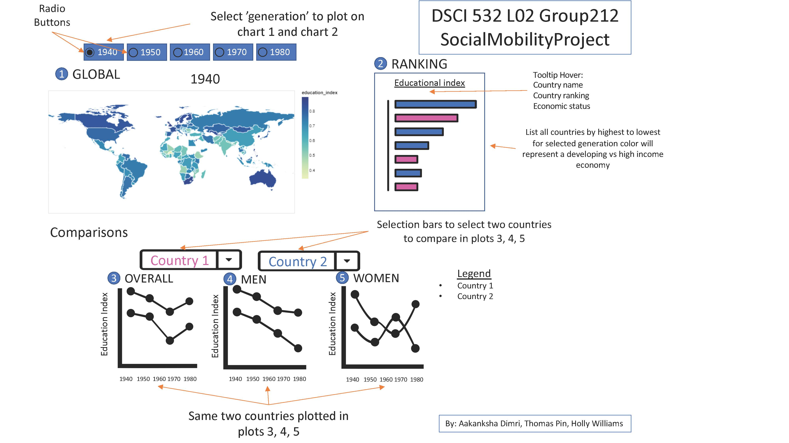

# DSCI_532_L02_Group212_SocialMobilityProject

Holly Williams, Aakanksha Dimri, and Thomas Pin's DSCI 532 dashboard project on international social mobility. 

## Link to app

[LINK](https://dsci-532-l02-gr212-milestone2.herokuapp.com/)

## Description of our app & sketch 

In an ideal world, every child would have the opportunity to achieve success regardless of what social class they happened to be born into. In other words, everyone would have unlimited potential for upward socio-economic mobility and their fate would not be pre-determined by their parent's income, education, or class.  

This visualization app uses educational mobility as a proxy for overall socio-economic mobility to show how it has changed globally over the last four generations. The app will feature a global map that will allow users to get a big-picture view for a selected generation along with the ability to get specific information for any country. There is a bar chart next to the plot showing the overall ranking of all countries for the selected generation.  Below the map, the app will include three interactive plots where the user can select two countries or regions to compare against each other more closely in terms of overall education index, and education index for men and women.  

### Functionality

Map and bar chart:
- Use the radio buttons to select a generation to show on the map and bar chart (i.e. 1940 shows the average education mobility index for people born in the 1940's)
- Hover over any country / bar to get specific information on the country name, education mobility index (EMI) and overall rank for that generation.
- Use `shift + click` to select multiple countries on either the map or bar chart to see where they appear on the other chart.

Three line plots:
 - These show the overall EMI over time and separated by boys (sons) and girls (daughters)
 - Use the drop-down to select items to compare by either scrolling or by typing and using auto-complete
 - Options include countries, continents, or economy types (high-income or developing).  For example, you could compare a specific country like Canada to Europe and all high-income economies in one plot. You can select as many combinations of countries, economies, and continents as you like!

### Limitations

Some limitations of our app include:
 - it only includes information on education mobility (later on, we could consider adding more data on overall income mobility and indicators of mobility to be able to dig into deeper research questions)
 - countries with `NaN` values do not show up on the plot (spent a ridiculous amount of hours trying to troubleshoot this to no avail)
 - small countries are hard to see on the map (in the future, we may try to facet by continent or see if there are ways to make it zoomable)
 - interactivity between the world map and the bar chart does not extend to the line chart(s) (due to time limitation(s) we could not explore how to achieve this functionality)

## Links

Links to important files:
 - [Heroku App](https://dsci-532-l02-gr212-milestone2.herokuapp.com/)
 - [App proposal](https://github.com/UBC-MDS/DSCI_532_L02_Group212_SocialMobilityProject/blob/master/proposal.md)
 - [Code of Conduct](https://github.com/UBC-MDS/DSCI_532_L02_Group212_SocialMobilityProject/blob/master/CODE_OF_CONDUCT.md)
 - [Contributing](https://github.com/UBC-MDS/DSCI_532_L02_Group212_SocialMobilityProject/blob/master/CONTRIBUTING.md)
 - [License](https://github.com/UBC-MDS/DSCI_532_L02_Group212_SocialMobilityProject/blob/master/LICENSE.md)

 This repo contains the following subfolders:
 - `data`: contains all raw data for the dashboard
 - `src`: contains all code files used to wrangle the data, create plots, and make the dashboard
 - `img`: contains saved images and plots

