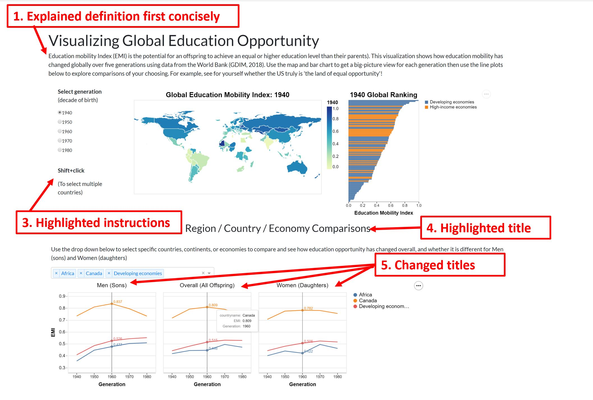

# Reflection

## App Critique

### What it does well

We think our app is clean and concise without a lot of superfluous information. The interactive features have all been designed with specific purposes in mind, and not just for the sake of it. 

### Limitations

Some limitations of our app include:
 - it only includes information on education mobility
 - countries with `NaN` values do not show up on the plot (spent a ridiculous amount of hours trying to troubleshoot this to no avail)
 - small countries are hard to see on the map

### Future Improvements and Additions

Potential additions / improvements include:
 - adding more data on overall income mobility and indicators of mobility to be able to dig into deeper research questions
 - making the map interactive (zoomable), or faceting by continent
 - adding a selection filter to the bar chart to be able to filter the number of countries shown (i.e. top 20, bottom 10, etc)

## Feedback

### Feedback received last week and in Lab 3

Feedback related to the app:
- change titles of the line plots [issue #37](https://github.com/UBC-MDS/DSCI_532_L02_Group212_SocialMobilityProject/issues/37#issue-530494890)
- EMI abbreviation is not clear [issue #45](https://github.com/UBC-MDS/DSCI_532_L02_Group212_SocialMobilityProject/issues/45#issue-532984453) and [issue #43](https://github.com/UBC-MDS/DSCI_532_L02_Group212_SocialMobilityProject/issues/43#issue-532981258)
- make the `shift+click` functionality more obvious [issue #45](https://github.com/UBC-MDS/DSCI_532_L02_Group212_SocialMobilityProject/issues/45#issue-532984453) and [issue #44](https://github.com/UBC-MDS/DSCI_532_L02_Group212_SocialMobilityProject/issues/44#issue-532981833)
- make the bar chart filterable [issue #43](https://github.com/UBC-MDS/DSCI_532_L02_Group212_SocialMobilityProject/issues/43#issue-532981258)
- make the world map zoomable [issue #44](https://github.com/UBC-MDS/DSCI_532_L02_Group212_SocialMobilityProject/issues/44#issue-532981833)
- highlight line plot titles [issue #44](https://github.com/UBC-MDS/DSCI_532_L02_Group212_SocialMobilityProject/issues/44#issue-532981833)

We also received some conflicting comments on the colour changes (some didn't like the map colours, others did) and descriptive text at the beginning (again, some loved it and others hated it).

Feedback not related to the app:
- updating our sketch (we received this feedback too late to implement in milestone 2) [issue #37](https://github.com/UBC-MDS/DSCI_532_L02_Group212_SocialMobilityProject/issues/37#issue-530494890)
- adding expected behaviour to our team contract [issue #37](https://github.com/UBC-MDS/DSCI_532_L02_Group212_SocialMobilityProject/issues/37#issuecomment-560044447)
- make research questions more general [issue #37](https://github.com/UBC-MDS/DSCI_532_L02_Group212_SocialMobilityProject/issues/37#issuecomment-560044447)

### Strategy for addressing feedback / maintenance

We decided to prioritize the general changes (not related to the app) and the changes to the app that would have the most meaningful impact on the app appearance and usability rather than factoring and cleaning up code. We are also switching up datasets for the dashboard and wanted to prioritize cleaning, wrangling, and starting plots for the new dataset over cleaning up code for the previous dataset.

### Specific changes made

In the third week, we were able to incorporate the following suggestions in our app:
1. Changed the definition of Education Mobility Index (EMI) to make it concise and impactful
2. Instructions to effectively interact with the world map and bar plot were added
3. Changed the title of the line plots to make them more meaningful
4. Highlighted the title "Region / Country / Economy Comparisons"
5. Formatted the titles, axis, legend(s) etc. for all plots
6. Adjusted the alignment and proportions of the world map and the bar plot

We also made the following changes unrelated to our app:
 - updated our [Code of Conduct](https://github.com/UBC-MDS/DSCI_532_L02_Group212_SocialMobilityProject/blob/master/CODE_OF_CONDUCT.md) to include a section on 'Expected Behaviour'.
 - updated our sketch in the [README]((https://github.com/UBC-MDS/DSCI_532_L02_Group212_SocialMobilityProject/blob/master/README.md)) to reflect latest feedback
 - updated research questions in our [proposal]((https://github.com/UBC-MDS/DSCI_532_L02_Group212_SocialMobilityProject/blob/master/proposal.md))

### Not addressed

The following suggestions were not incorporated in milestone 3 due to time constraints:
- Countries with `NaN` values do not show up on the plot (we spent a ridiculous amount of hours trying to troubleshoot this to no avail, and even stumped Firas)
- Add zoom in functionality in the world map, as small countries are hard to see on the map
     - This functionality does not exist in Altair [link_to_open_issue](https://github.com/altair-viz/altair/issues/632)
     - Though regular zoom in facilitated by all brower(s) should be an acceptable workaround for the purpose of this lab
     - Faceting by continent is also a feasible workaround and infact potentially be more insightful when compared to the whole world
- Ability to filter the bar chart to say, top 10 countries or specific countries selected

The following suggestions were not implemented as per group consensus:
- Change colourscheme of the world map
- Add a line that mentions that missing data is not incroporated in the plots

### Reflection on the usefulness of the feedback we received

Overall the feedback activity conducted during lab 3 session was a productive exercise. It had a positive and constructive impact on our work. We were able to prioritize the suugestions based on their frequency among the reviewers. The "fly on the wall" activity in particular stood out, as it was enlightening to see how users interacted with our app without instruction.  We expected people to either intuitively pick up that you could use `shift+click` to select multiple items (or that they would read the description describing that functionality), but many people didn't pick up on it until instructed!  Some suggestions were improvements that we had already thought of and didn't have time to implement (like making the bar plot filterable and adding zoom or faceting functionality to the map), but it was interesting to hear about the things we hadn't thought of already (like making the EMI definition more clear).  

